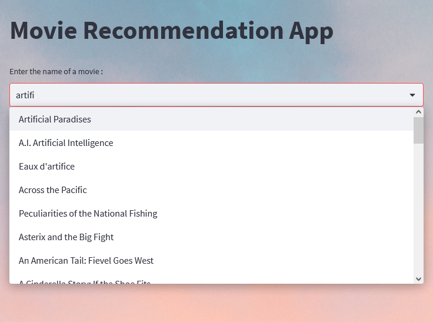
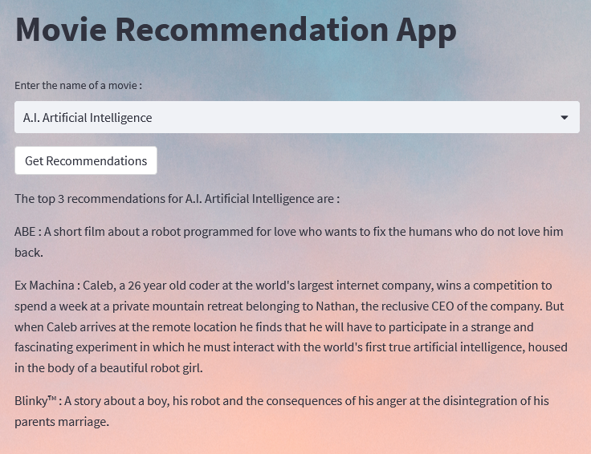

# Movie Recommendations

This is an independent 8-day learning project being completed at BeCode Liège.

## Introduction :

The Movie Recommendation App is a web application that recommends movies to users based on the similarity of movie overviews. The application is built using the `streamlit` library in Python, which is used to build interactive web applications. The app uses a pre-trained `SentenceTransformer` model to generate embeddings of movie overviews, and then computes the cosine similarity between these embeddings to generate a similarity matrix.

## The SentenceTransformer library and the model :

The "sentence transformer" library is used to generate high-dimensional vector representations of the movie plot. These vector representations capture the underlying meaning of the plot and can be used to compare the similarity between the input movie and other movies in a database.

The library utilizes a pre-trained transformer-based neural network architecture to generate the vector representations. The neural network model processes the input movie plot through multiple layers of encoding, generating a high-dimensional vector representation of the plot.

Once the vector representations of movie plots are generated, they can be compared using similarity metrics to determine the movies with similar plots in the database. This enables the movie recommendation system to suggest movies with similar themes and plot elements to the input movie, improving the accuracy of the recommendation system.

Overall, the "sentence transformer" library provides a powerful tool for generating vector representations of movie plots, making it useful in movie recommendation systems based on plot similarity.

In this case, the "All-MiniLM-L6-v2" model was choosen, it's a specific pre-trained language model developed by Hugging Face, a company that specializes in natural language processing (NLP) technologies.

The name "MiniLM" refers to the model architecture, which is a smaller and more efficient version of the popular BERT model. The "L6" in the name refers to the number of layers in the model, which in this case is 6. Finally, the "v2" indicates that this is the second version of the model, which has been further fine-tuned and improved over the original version.

## Tool and App :

## 1. *data_preprocessor.ipynb* :

```python
# Imports
import pandas as pd

# Load movie dataset
movies = pd.read_csv("./data/movies_metadata.csv", usecols=[5, 9, 20, 22, 23])

# Drop null values
movies = movies.dropna()

# Drop rows where overview is "No overview found." or "No overview"
movies = movies[(movies["overview"] != "No overview found.") & (movies["overview"] != "No overview")]

# Keep only movies with at least 10 votes (50% interval) and vote_average of at least 6
movies = movies[(movies["vote_count"] >= 10) & (movies["vote_average"] >= 6)]

# Remove duplicate titles with lowest vote average
mask = movies.duplicated(subset=["title"], keep=False)
movies = movies[~(mask & (movies["vote_average"] == movies[mask]["vote_average"].min()))]

# Remove strictly identical remaining duplicated titles
movies = movies.drop_duplicates(subset="title")

# Sort the dataframe in alphabetical order
movies.sort_values("title", inplace=True)

# Assign indexes
movies["index"] = [i for i in range(0, len(movies))]

# Save file
movies.to_csv("./data/movies_metadata_preprocessed.csv")

movies
```

This notebook loads the movie dataset from a CSV file and preprocesses it by 
dropping null values, removing movies with less than 10 votes and a vote average below 6, dropping duplicate titles with the lowest vote average, and sorting the dataframe in alphabetical order. It assigns an index to each movie and saves the preprocessed data to a new CSV file that will be used in the movie recommendation app.

## 2. *streamlit.py* :

This is the streamlit application.

The code is divided into several sections, each of which performs a specific function. We will now go over each section of the code in more detail.

### 2.1 Imports :

The first section of the code imports the necessary libraries and modules that are needed to run the application. The following libraries and modules are imported :

- `pandas` - for data manipulation and analysis
- `cosine_similarity` - from `sklearn.metrics.pairwise` for computing cosine similarity between embeddings
- `SentenceTransformer` - for generating sentence embeddings
- `streamlit` - for building the web application

### 2.2 Load Movie Dataset :

The second section of the code loads the movie metadata from a CSV file called `movies_metadata_preprocessed.csv`. The metadata includes information such as the title of the movie, the overview of the movie, and other relevant information. The `pandas` library is used to load the CSV file.

### 2.3 Functions :

```python
# Get title of movie
def get_title(index):
    return movies[movies.index == index]["title"].values[0]

# Get index of movie
def get_index(title):
    return movies[movies.title == title]["index"].values[0]

# Compute the similarity matrix and store it in the cache for Streamlit
@st.cache_resource
def compute_similarity_matrix():
    # Load pre-trained model
    bert = SentenceTransformer("all-MiniLM-L6-v2")

    # Get Embeddings for movie overviews
    sentence_embeddings = bert.encode(movies["overview"].tolist())

    # Compute similarity between movie overviews
    similarity = cosine_similarity(sentence_embeddings)

    return similarity
```

The third section of the code defines several functions that are used throughout the application. The functions include :

- `get_title(index)` - Returns the title of a movie given its index.
- `get_index(title)` - Returns the index of a movie given its title.
- `compute_similarity_matrix()` - Computes the similarity matrix between the embeddings of the movie overviews.

### 2.4 Streamlit app :

```python
# Streamlit app
# Define app title
st.title("Movie Recommendation App")

# Page appearance and background image
page_bg_img = f"""
<style>
[data-testid="stAppViewContainer"] > .main {{
background-image: url("https://images.unsplash.com/photo-1564115484-a4aaa88d5449");
background-size: 100%;
background-position: top left;
background-repeat: no-repeat;
background-attachment: local;
}}

[data-testid="stHeader"] {{
background: rgba(0,0,0,0);
}}

[data-testid="stToolbar"] {{
right: 2rem;
}}
</style>
"""

# Page configuration for HTML/CSS
st.markdown(page_bg_img, unsafe_allow_html=True)

# Create an input field for the user to enter a movie with autocompletion feature
user_movie = st.selectbox("Enter the name of a movie :", movies["title"].tolist())
```

The fourth section of the code creates the streamlit application. This includes defining the title of the application, setting the appearance of the page, and creating an input field for the user to enter the name of a movie.

The `page_bg_img` variable is used to set the background image of the application and other visual details. The `st.markdown()` function is used to display the background image. The `st.selectbox()` function is used to create an input field where the user can select a movie from a dropdown list.

### 2.5 Recommendation Code :

```python
# Create a submit button to trigger the recommendation code
if st.button("Get Recommendations"):
    # Perform the recommendation and display the results
    recommendations = sorted(list(enumerate(similarity[get_index(user_movie)])), key=lambda x: x[1], reverse=True)
    st.write(f"The top 3 recommendations for {user_movie} are :")
    # Output the top 3 recommended movies
    for i in range(1, 4):
        recommended_movie_title = get_title(recommendations[i][0])
        recommended_movie_overview = movies.loc[movies["title"] == recommended_movie_title, "overview"].iloc[0]
        st.write(f"{recommended_movie_title} : {recommended_movie_overview}")
```

The fifth section of the code performs the recommendation based on the input movie. When the user clicks the "Get Recommendations" button, the application computes the similarity between the input movie and all other movies in the dataset. The results are then sorted based on their similarity score and the top 3 movies are displayed, along with their overviews.

The `recommendations` variable is a list of tuples containing the index of the recommended movie and its similarity score. The `sorted()` function is used to sort the recommendations based on their similarity score. The `st.write()` function is used to display the top 3 recommended movies along with their overviews.

### 2.6 Caching :

The code also includes caching using `@st.cache_resource` to speed up the computation of the similarity matrix. This means that the similarity matrix will only be computed once and then stored in cache, so that subsequent requests for the similarity matrix will be served from cache instead of being recomputed. This significantly reduces the time it takes to generate the recommendations.

## Visuals :

Thanks to the autosuggestion feature, we can begin typing a movie title and receive a list of matching titles :



Afterward, we can retrieve the results by clicking the "Get Recommendations" button :



## Results observations :

As we can see, the recommendations are related to the theme of artificial intelligence and robots, which is similar to the input movie "A.I. Artificial Intelligence". The algorithm that generated the recommendations analyze the movie plot to come up with similar movies that users might enjoy.

The first recommendation, "ABE," is a short film that explores the emotional side of robots and their relationship with humans. It shares a similar theme with "A.I. Artificial Intelligence" as both movies depict the relationship between humans and artificial beings.

The second recommendation, "Ex Machina," is a sci-fi movie that explores the concept of consciousness and artificial intelligence. Which is also very similar.

The third recommendation, "Blinky™," is a short film that explores the impact of anger and emotions on a boy and his robot. This recommendation seems to be more focused on the emotional aspects of the story and the relationships between the characters.

Overall, these recommendations are suitable for users who are interested in movies about artificial intelligence, robots, and their relationships with humans.

## Installation/Requirements/Usage :

We have provided a `requirements.txt` file, and the project was developed using Python 3.10.6. To install the required libraries, you can use the following command :

```shell
pip install -r requirements.txt
```

This project use the following librairies :

* pandas==1.5.2

* scikit_learn==1.2.2

* sentence_transformers==2.2.2

* streamlit==1.21.0

To run the app, first install the libraries listed above, and then run the app by executing this command :

```shell
streamlit run streamlit.py
```

## Conclusions :

The project was enjoyable, but we had to complete it quickly. We also tried to test sentiment analysis by analyzing the overall sentiment of a movie's subtitle file, but it took a lot of time and we didn't end up implementing it due to this reason, as well as the lack of a reliable source to download full subtitles from every movie in batches.

## Author :

Sébastien Rahir

[LinkedIn](https://www.linkedin.com/in/sebastien-rahir/)
